Class 8
================
Kevin Tang
10/25/18

K-means clustering
------------------

Our first example with **kmeans()** function.

``` r
# Examle plot to see how Rmarkdown works 
plot(1:10,typ="l")
```

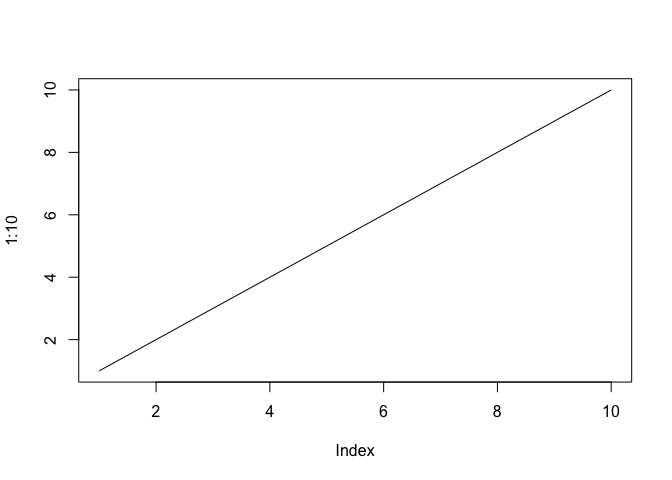

Back to kmeans... \# Inspect/print the results

``` r
tmp <- c(rnorm(30,-3), rnorm(30,3))
x <- cbind(x=tmp, y=rev(tmp))
plot(x)
```

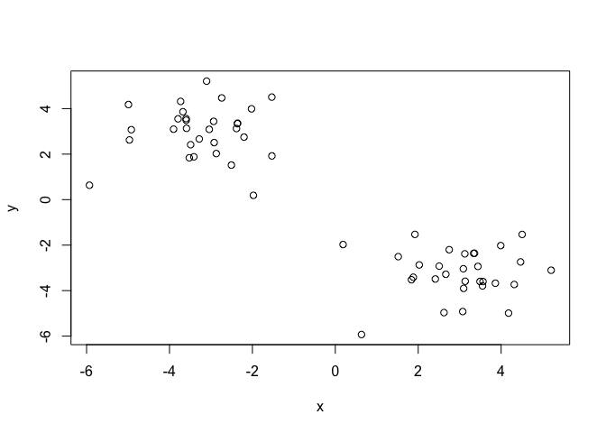

``` r
k <- kmeans(x,centers=2,nstart=20)
k
```

    ## K-means clustering with 2 clusters of sizes 30, 30
    ## 
    ## Cluster means:
    ##           x         y
    ## 1 -3.229429  2.991686
    ## 2  2.991686 -3.229429
    ## 
    ## Clustering vector:
    ##  [1] 1 1 1 1 1 1 1 1 1 1 1 1 1 1 1 1 1 1 1 1 1 1 1 1 1 1 1 1 1 1 2 2 2 2 2
    ## [36] 2 2 2 2 2 2 2 2 2 2 2 2 2 2 2 2 2 2 2 2 2 2 2 2 2
    ## 
    ## Within cluster sum of squares by cluster:
    ## [1] 68.14306 68.14306
    ##  (between_SS / total_SS =  89.5 %)
    ## 
    ## Available components:
    ## 
    ## [1] "cluster"      "centers"      "totss"        "withinss"    
    ## [5] "tot.withinss" "betweenss"    "size"         "iter"        
    ## [9] "ifault"

Q. How many points are in each cluster?
=======================================

``` r
k$size
```

    ## [1] 30 30

Q. What ‘component’ of your result object details
=================================================

- cluster size?
===============

- cluster assignment/membership?
================================

``` r
table(k$cluster)
```

    ## 
    ##  1  2 
    ## 30 30

- cluster center?
=================

``` r
k$centers
```

    ##           x         y
    ## 1 -3.229429  2.991686
    ## 2  2.991686 -3.229429

Plot x colored by the kmeans cluster assignment and
===================================================

add cluster centers as blue points
==================================

``` r
palette(c("blue","red"))
plot(x,col=k$cluster)
points(k$centers,col="green",pch=20,cex=3)
```

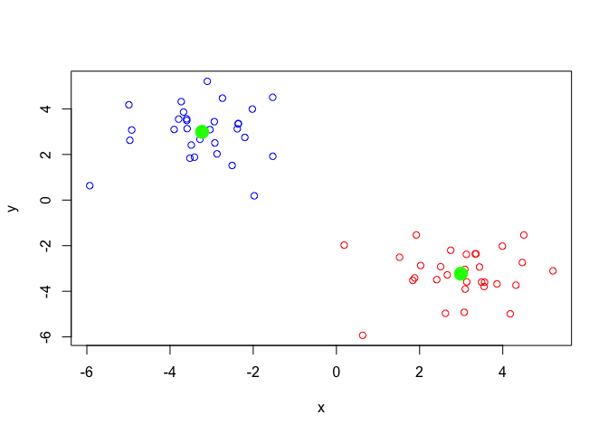 \# Q. Repeat for k=3, which has the lower tot.withinss?

``` r
k3 <- kmeans(x,centers=3,nstart=20)
k3$tot.withinss
```

    ## [1] 113.0165

``` r
k$tot.withinss
```

    ## [1] 136.2861

Hierarchical clustering in R
============================

Let's try out the **hclust()** function for Hierarchical clustering in R. This function needs a distance matrix as input!

``` r
d <- dist(x)
hc <- hclust(d)
plot(hc)
```

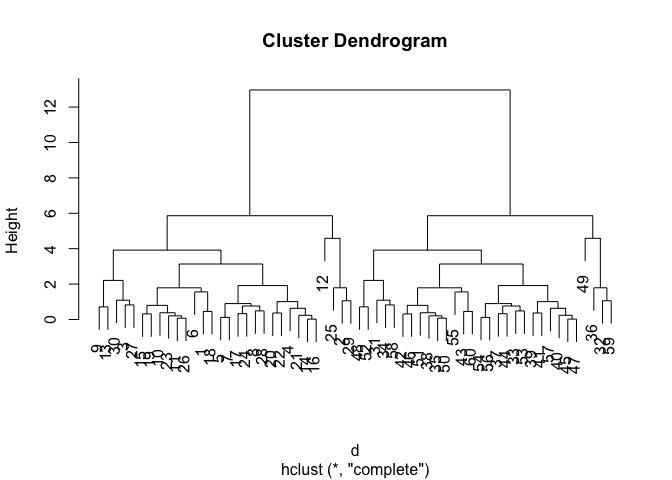

``` r
plot(hc)
# Draw a line on the dendrogram
abline(h=8,col="red")
```

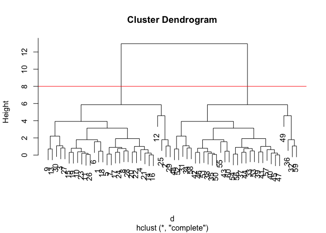

``` r
# Cut the tre to yield cluster membership vector
cutree(hc,h=8)
```

    ##  [1] 1 1 1 1 1 1 1 1 1 1 1 1 1 1 1 1 1 1 1 1 1 1 1 1 1 1 1 1 1 1 2 2 2 2 2
    ## [36] 2 2 2 2 2 2 2 2 2 2 2 2 2 2 2 2 2 2 2 2 2 2 2 2 2

``` r
cutree(hc,k=2)
```

    ##  [1] 1 1 1 1 1 1 1 1 1 1 1 1 1 1 1 1 1 1 1 1 1 1 1 1 1 1 1 1 1 1 2 2 2 2 2
    ## [36] 2 2 2 2 2 2 2 2 2 2 2 2 2 2 2 2 2 2 2 2 2 2 2 2 2

### A more real example of data clustering

``` r
# Step 1. Generate some example data for clustering
x <- rbind(
 matrix(rnorm(100, mean=0, sd = 0.3), ncol = 2), # c1
 matrix(rnorm(100, mean = 1, sd = 0.3), ncol = 2), # c2
 matrix(c(rnorm(50, mean = 1, sd = 0.3), # c3
 rnorm(50, mean = 0, sd = 0.3)), ncol = 2))
colnames(x) <- c("x", "y")
# Step 2. Plot the data without clustering
plot(x)
```

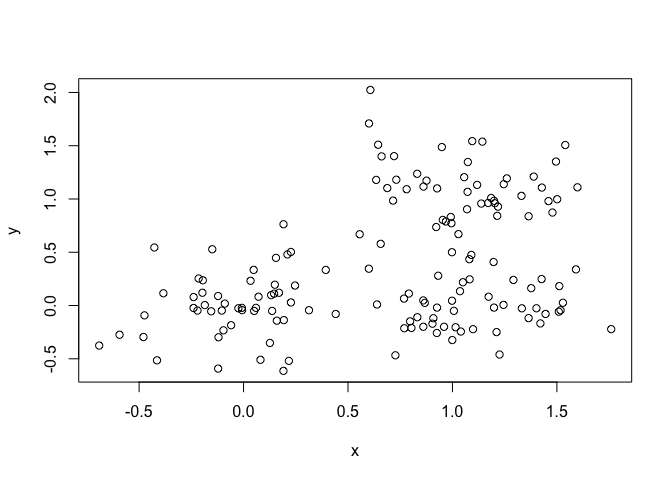

``` r
# Step 3. Generate colors for known clusters
# (just so we can compare to hclust results)
col <- as.factor( rep(c("c1","c2","c3"), each=50) )
palette(c("red", "blue", "green"))
plot(x, col=col, pch=20)
```

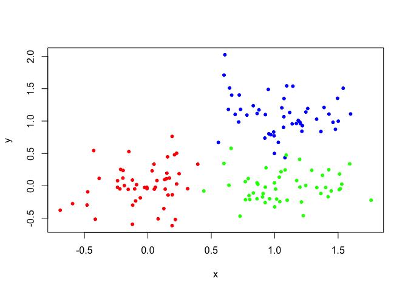 \# Q. Use the dist(), hclust(), plot() and cutree() \# functions to return 2 and 3 clusters

``` r
d1 <- dist(x)
hc1 <- hclust(d1)
plot(hc1)
```

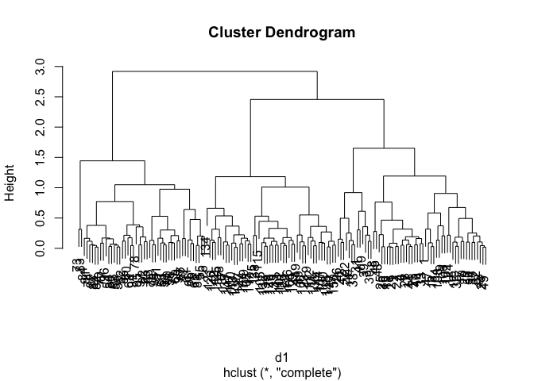

``` r
g2 <- cutree(hc1, k=2)
g3 <- cutree(hc1, k=3)
plot(x,col=g2,pch=20)
```

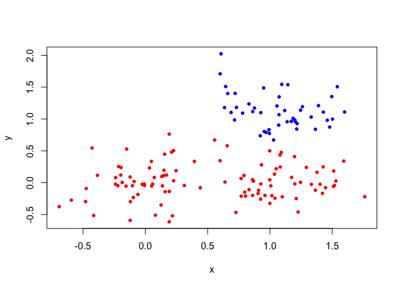

``` r
plot(x,col=g3,pch=20)
```

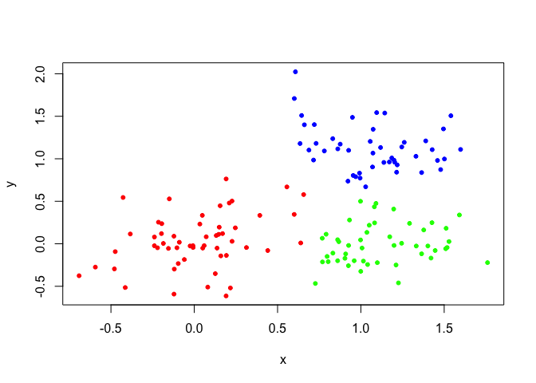 \# Q. How does this compare to your known 'col' groups?

``` r
table(g3, col)
```

    ##    col
    ## g3  c1 c2 c3
    ##   1 50  1  4
    ##   2  0 47  0
    ##   3  0  2 46

``` r
mydata <- matrix(nrow=100, ncol=10) 
rownames(mydata) <- paste("gene", 1:100, sep="") 
colnames(mydata) <- c( paste("wt", 1:5, sep=""),
 paste("ko", 1:5, sep="") ) 
for(i in 1:nrow(mydata)) {
 wt.values <- rpois(5, lambda=sample(x=10:1000, size=1))
 ko.values <- rpois(5, lambda=sample(x=10:1000, size=1))

 mydata[i,] <- c(wt.values, ko.values)
}
head(mydata)
```

    ##       wt1 wt2 wt3 wt4 wt5 ko1 ko2 ko3  ko4 ko5
    ## gene1 391 405 433 420 398 918 938 907  912 927
    ## gene2 350 333 321 320 347 926 939 955 1003 973
    ## gene3 647 656 644 666 600 399 359 377  352 363
    ## gene4 111 107 106 105 121 557 528 604  596 543
    ## gene5 339 363 352 338 383 688 730 774  766 766
    ## gene6 557 575 539 569 568  85  76  78   74  84

Note the prcomp() functions wants us to take

``` r
head(t(mydata))
```

    ##     gene1 gene2 gene3 gene4 gene5 gene6 gene7 gene8 gene9 gene10 gene11
    ## wt1   391   350   647   111   339   557   484  1052   210    827    880
    ## wt2   405   333   656   107   363   575   526   970   185    898    877
    ## wt3   433   321   644   106   352   539   544  1018   200    904    854
    ## wt4   420   320   666   105   338   569   526   984   170    926    909
    ## wt5   398   347   600   121   383   568   547   922   209    885    840
    ## ko1   918   926   399   557   688    85   405   509   612     94    220
    ##     gene12 gene13 gene14 gene15 gene16 gene17 gene18 gene19 gene20 gene21
    ## wt1     60    871    515    560    458     35    919    233     27    193
    ## wt2     72    945    525    510    438     33    872    249     23    186
    ## wt3     68    921    485    506    445     26    917    233     35    177
    ## wt4     62    911    529    559    406     26    972    238     34    164
    ## wt5     69    905    532    543    458     33    902    255     31    188
    ## ko1    610    250    411    422    989    660    471    328    188    127
    ##     gene22 gene23 gene24 gene25 gene26 gene27 gene28 gene29 gene30 gene31
    ## wt1    742    384     41    231    881    761    910     36    105    171
    ## wt2    796    400     46    202    870    782    955     37    110    158
    ## wt3    809    373     48    231    890    787    951     41    103    150
    ## wt4    745    401     42    211    840    809    952     35    108    173
    ## wt5    815    404     55    204    847    787   1010     33     96    159
    ## ko1    124    866    766    399    751    990    521    591    420    143
    ##     gene32 gene33 gene34 gene35 gene36 gene37 gene38 gene39 gene40 gene41
    ## wt1    168    128    662    375    329    902    756    631    646     22
    ## wt2    200    150    665    384    282    911    766    657    600     19
    ## wt3    205    133    642    364    279    868    767    651    678     15
    ## wt4    232    129    648    342    311    944    745    639    606     17
    ## wt5    210    145    674    374    297    976    732    666    595     23
    ## ko1    105    648     35    415     79    526    874    607    149    614
    ##     gene42 gene43 gene44 gene45 gene46 gene47 gene48 gene49 gene50 gene51
    ## wt1    946    554    606    548   1019    526    764    362    510    620
    ## wt2    978    614    570    515    958    527    795    347    474    596
    ## wt3   1000    548    589    538   1049    536    777    351    487    566
    ## wt4    967    598    623    595   1049    522    751    350    504    641
    ## wt5    960    574    561    501   1019    498    771    372    522    559
    ## ko1    465    155    615    140    725    123    400    200    184    462
    ##     gene52 gene53 gene54 gene55 gene56 gene57 gene58 gene59 gene60 gene61
    ## wt1    943    743    731     75    518    709    294    697    279    362
    ## wt2    900    757    700     71    510    743    291    670    268    374
    ## wt3   1003    706    745     75    466    680    273    648    277    335
    ## wt4    934    702    761     82    467    718    290    657    288    360
    ## wt5    999    679    740     70    488    724    258    631    262    358
    ## ko1    524    481    725    700    580     79    689    128    602    611
    ##     gene62 gene63 gene64 gene65 gene66 gene67 gene68 gene69 gene70 gene71
    ## wt1     47    170    800    219    524    424    217    581    859    844
    ## wt2     43    161    849    221    490    395    210    616    851    769
    ## wt3     50    165    885    229    491    404    233    639    819    768
    ## wt4     47    161    782    231    482    410    201    590    812    808
    ## wt5     46    171    759    202    491    422    204    584    795    805
    ## ko1    734    254    385    834    173    587   1001    189    156    707
    ##     gene72 gene73 gene74 gene75 gene76 gene77 gene78 gene79 gene80 gene81
    ## wt1    204    974    327    676    640    231    509    493    779    368
    ## wt2    208    910    340    729    653    215    511    560    729    331
    ## wt3    164    960    342    664    643    259    525    564    723    290
    ## wt4    164    925    359    719    619    222    502    533    789    292
    ## wt5    171    961    340    693    648    259    500    545    746    328
    ## ko1    254    302    498     37    163    582     12    873    776    889
    ##     gene82 gene83 gene84 gene85 gene86 gene87 gene88 gene89 gene90 gene91
    ## wt1    856    124     94    828     97    234    330    773    658    132
    ## wt2    900    118     67    796    116    245    386    787    668    119
    ## wt3    980     96     89    885    120    220    359    776    637    107
    ## wt4   1008    113     71    867    111    259    357    837    678    136
    ## wt5    979    124     76    831     91    209    357    760    631    101
    ## ko1    862    281    187    110    691    493    139    100    112    945
    ##     gene92 gene93 gene94 gene95 gene96 gene97 gene98 gene99 gene100
    ## wt1    174    145    840    644    793    289     99    162     916
    ## wt2    156    147    835    668    813    277     81    163     860
    ## wt3    181    134    832    635    785    251     93    169     825
    ## wt4    155    134    803    663    833    285     75    152     853
    ## wt5    156    137    828    621    754    273     86    155     887
    ## ko1    666    123    851    713    504    716    416    569     457

Now lets try to find "structure" in this data with **prcomp()**

``` r
pca <- prcomp(t(mydata), scale=TRUE)
pca
```

    ## Standard deviations (1, .., p=10):
    ##  [1] 9.561306e+00 1.490437e+00 1.322610e+00 1.222744e+00 1.134129e+00
    ##  [6] 8.436135e-01 6.997138e-01 6.034253e-01 5.137886e-01 2.843823e-15
    ## 
    ## Rotation (n x k) = (100 x 10):
    ##                  PC1           PC2           PC3           PC4
    ## gene1    0.104446279 -2.386098e-02 -0.0008538697  0.0101445435
    ## gene2    0.104368276  2.200034e-02 -0.0240210582 -0.0285632117
    ## gene3   -0.103556520  1.500425e-02  0.0145018521  0.0828821501
    ## gene4    0.104024671  2.194520e-02 -0.0052026083  0.0025281418
    ## gene5    0.103686566  1.084682e-02 -0.0295662531 -0.0573056922
    ## gene6   -0.104501485  9.798075e-03 -0.0012784072 -0.0023831223
    ## gene7   -0.098472114 -1.735404e-01  0.1218935080 -0.0504519285
    ## gene8   -0.103491468  1.536783e-02 -0.0167366838  0.0001377701
    ## gene9    0.104240730 -1.136638e-05  0.0300691356 -0.0013924646
    ## gene10  -0.104439797 -1.408766e-02  0.0031469885 -0.0001409126
    ## gene11  -0.104350930  4.542628e-03 -0.0260283005 -0.0157864323
    ## gene12   0.104319106 -7.015857e-03 -0.0179261042 -0.0002054068
    ## gene13  -0.104377621 -5.575682e-03  0.0269972875 -0.0017279275
    ## gene14  -0.100591550  9.309112e-02 -0.0036898008  0.1141572103
    ## gene15  -0.092480737 -2.614971e-02 -0.2862965945  0.0235787807
    ## gene16   0.104256333 -2.157659e-02  0.0183437270 -0.0343976414
    ## gene17   0.104380424 -2.615840e-02 -0.0027565868  0.0013741280
    ## gene18  -0.103989372 -1.135561e-02 -0.0463712359  0.0178595276
    ## gene19   0.097575987 -1.026369e-01 -0.0288324387 -0.0800837953
    ## gene20   0.103899453  8.912398e-03 -0.0184280891 -0.0205606993
    ## gene21  -0.097931999  1.439911e-01  0.0345507296 -0.1477275742
    ## gene22  -0.104263795 -1.176720e-02  0.0296384781 -0.0323626289
    ## gene23   0.104364802  1.107260e-02 -0.0022298005  0.0318610278
    ## gene24   0.104329189 -1.384541e-02  0.0232709692  0.0276153838
    ## gene25   0.103511859 -3.299008e-03 -0.0453862990  0.0255216297
    ## gene26  -0.101524991  7.808213e-03  0.1270541273  0.0182738840
    ## gene27   0.099871215 -9.833805e-02  0.0740239523  0.1741905572
    ## gene28  -0.103972441  7.319916e-04  0.0200803237  0.0012557800
    ## gene29   0.104197165  2.844243e-02  0.0029070909  0.0214588661
    ## gene30   0.104319963 -3.099611e-04  0.0166682318  0.0181912612
    ## gene31  -0.088448073  9.607143e-02 -0.1487501017  0.3385184977
    ## gene32  -0.100249519 -5.027092e-02 -0.0703503671  0.0611033551
    ## gene33   0.104313642 -2.214498e-02  0.0087913777 -0.0143626692
    ## gene34  -0.104533090  7.541980e-03  0.0070941765 -0.0099859639
    ## gene35   0.089842240  2.384511e-01 -0.0195763566 -0.0395391738
    ## gene36  -0.103806236  1.137349e-02 -0.0470450587 -0.0002353474
    ## gene37  -0.103693211 -2.982833e-03 -0.0290877814  0.0086754417
    ## gene38   0.094895912  1.267137e-01  0.1217520083  0.1097937793
    ## gene39  -0.001755521 -7.547402e-02 -0.0942148244 -0.7340660644
    ## gene40  -0.104040729 -4.922596e-03  0.0090107408  0.0059326378
    ## gene41   0.104513297 -1.040656e-02 -0.0092705427  0.0050634159
    ## gene42  -0.104374681 -1.563455e-02  0.0195980872 -0.0011151442
    ## gene43  -0.104129893  5.040402e-03  0.0003472936 -0.0261430971
    ## gene44   0.083258868 -1.858151e-01 -0.2819796433 -0.0003295799
    ## gene45  -0.103835361 -3.095900e-02 -0.0554504964  0.0222880368
    ## gene46  -0.102050645 -6.395785e-02 -0.0735852295 -0.0582970606
    ## gene47  -0.104404610  1.794825e-02  0.0127305157  0.0238697874
    ## gene48  -0.104212285  5.376278e-03  0.0408673001 -0.0363776572
    ## gene49  -0.103630357  4.898410e-02 -0.0012201097  0.0040633233
    ## gene50  -0.103916414 -2.858646e-02 -0.0450201699 -0.0212570521
    ## gene51  -0.099656080  7.894877e-02 -0.0862999364  0.1273805280
    ## gene52  -0.103478126 -5.820788e-02  0.0473219062  0.0135552121
    ## gene53  -0.102933471  9.075245e-02  0.0400646713  0.0306691448
    ## gene54   0.006597506 -6.247502e-01 -0.2054186297  0.0863566741
    ## gene55   0.104533937 -1.714461e-02 -0.0071807600  0.0008899285
    ## gene56   0.098888525  5.106818e-02  0.0584272183 -0.0563428626
    ## gene57  -0.104434165  6.849181e-03  0.0057129550 -0.0203642538
    ## gene58   0.104264826 -1.208796e-02  0.0040110894 -0.0072583249
    ## gene59  -0.104327070  1.552647e-02 -0.0032126843 -0.0015386030
    ## gene60   0.103935806 -5.041468e-02  0.0099876723  0.0059902142
    ## gene61   0.103651108 -3.786337e-02 -0.0058156097 -0.0450815446
    ## gene62   0.104557829 -2.230101e-03  0.0017925656  0.0114701620
    ## gene63   0.102821852 -8.126472e-02  0.0174088942 -0.0556299728
    ## gene64  -0.103316712  7.372272e-03  0.0704513526  0.0054584982
    ## gene65   0.104480394 -1.626707e-02 -0.0023191830  0.0034459679
    ## gene66  -0.104035537 -8.462788e-03  0.0064648621 -0.0093963874
    ## gene67   0.103261094  3.337456e-02 -0.0159356029  0.0645975633
    ## gene68   0.104482753  5.738739e-03 -0.0019039006  0.0136413665
    ## gene69  -0.104204621 -1.127869e-02  0.0306738028 -0.0176214447
    ## gene70  -0.104333100  1.353084e-02  0.0101195102 -0.0040431120
    ## gene71  -0.076610684  7.963877e-02 -0.3391102254 -0.2568035981
    ## gene72   0.094750960  2.343694e-01 -0.0035915762 -0.0748628674
    ## gene73  -0.104371509  3.918096e-04 -0.0039421847 -0.0149372334
    ## gene74   0.102284741  4.601358e-03 -0.0301444970  0.1064439302
    ## gene75  -0.104447820  8.097340e-03  0.0027889338  0.0003880019
    ## gene76  -0.104374569 -4.415797e-05  0.0124962755 -0.0325388541
    ## gene77   0.104115662 -4.217315e-03 -0.0167224425 -0.0210197152
    ## gene78  -0.104529622 -2.060188e-04  0.0121218434 -0.0065360562
    ## gene79   0.103869260 -1.057144e-02  0.0239525761  0.0081872774
    ## gene80   0.070210611  9.054521e-02 -0.4941145386 -0.0409851422
    ## gene81   0.104262144  4.365081e-02 -0.0118582681 -0.0039569997
    ## gene82  -0.063030997 -3.088754e-01 -0.1328922225  0.2474378080
    ## gene83   0.103512118  3.492352e-02 -0.0123627231 -0.0164139443
    ## gene84   0.102954693  3.745956e-02 -0.0147988387  0.0515928195
    ## gene85  -0.104421907 -2.040923e-02 -0.0060774241  0.0083907639
    ## gene86   0.104377420  1.261236e-02 -0.0184091202  0.0190841123
    ## gene87   0.102992145  7.412548e-02 -0.0677241791  0.0369446910
    ## gene88  -0.102863903 -2.482116e-02  0.0202600902 -0.0901980677
    ## gene89  -0.104449622 -5.427799e-03 -0.0215120662  0.0096679431
    ## gene90  -0.104460000  1.368653e-02 -0.0044068289  0.0070390846
    ## gene91   0.104398539  1.824286e-03 -0.0099248269  0.0437913889
    ## gene92   0.104472087 -2.099154e-02  0.0113422909  0.0107141330
    ## gene93  -0.076387802  3.109630e-01  0.0195101213  0.0777353618
    ## gene94   0.022977092 -2.715754e-01  0.5187396160 -0.1241523384
    ## gene95   0.086214576  8.395998e-02 -0.0119025449  0.0644043303
    ## gene96  -0.103543183  2.840295e-02 -0.0195870886  0.0347517895
    ## gene97   0.104257096  1.551532e-02 -0.0408436820  0.0173404628
    ## gene98   0.104306903  5.447266e-03 -0.0129127282  0.0209442083
    ## gene99   0.104178256  1.032761e-02 -0.0060486113  0.0210080808
    ## gene100 -0.103723447  1.435334e-02  0.0002422683  0.0008401452
    ##                   PC5           PC6           PC7           PC8
    ## gene1    0.0106778847 -0.0319339764  0.0069991094  0.0178880598
    ## gene2    0.0085052917  0.0150944083  0.0300981525 -0.0228611240
    ## gene3   -0.0353451453 -0.0225042811  0.0091619340  0.1300020330
    ## gene4    0.0327534190  0.0613528726  0.1024507317 -0.0178825003
    ## gene5    0.0794622337  0.0552602554  0.0111402030  0.0047607441
    ## gene6   -0.0034929208 -0.0108513461 -0.0322755731  0.0132689762
    ## gene7    0.0834226032 -0.0661678421  0.0115974299 -0.0007259541
    ## gene8   -0.0575124389  0.0629231404  0.0122505585  0.0741110351
    ## gene9   -0.0129587715  0.0458761023  0.0570627268 -0.0686009969
    ## gene10   0.0200817322 -0.0408681849  0.0165729328  0.0362921851
    ## gene11  -0.0212624951  0.0016154391  0.0222732780  0.0758974016
    ## gene12   0.0422535224  0.0405910106 -0.0335671540  0.0339821125
    ## gene13   0.0289923905  0.0075431224 -0.0006592351  0.0635841695
    ## gene14  -0.0141158676 -0.1082654420 -0.0201923239 -0.1495606679
    ## gene15  -0.0204264991  0.1999183890 -0.2907391902 -0.0225722877
    ## gene16  -0.0306594826 -0.0088862626 -0.0450796815 -0.0430005463
    ## gene17   0.0045164350  0.0228456348 -0.0610316238  0.0230311313
    ## gene18  -0.0329891305 -0.0280790273  0.0995019739 -0.0124652377
    ## gene19   0.0217094453 -0.0827431285 -0.4220751672  0.0437864444
    ## gene20   0.0028005650 -0.0240131314  0.1477628343 -0.0405124407
    ## gene21  -0.1025848180 -0.0817564268 -0.0539709662 -0.2464666929
    ## gene22   0.0408343560  0.0025825861 -0.0324482643 -0.0114802336
    ## gene23   0.0195919565  0.0024937792  0.0164157294 -0.0159185414
    ## gene24  -0.0172105360 -0.0384111337 -0.0160364207 -0.0418266573
    ## gene25   0.0124503619  0.0247757272 -0.0948513629 -0.0097004651
    ## gene26  -0.0850518402  0.0051519499 -0.0325564643 -0.0052597374
    ## gene27   0.0360899932  0.0289683325  0.0200748066  0.0369921182
    ## gene28   0.0662233435  0.0061481012  0.0359834577 -0.0746948797
    ## gene29   0.0145151312  0.0058993008  0.0950500184 -0.0250584972
    ## gene30  -0.0349294355 -0.0556264498  0.0201169695 -0.0045410426
    ## gene31  -0.0345949725  0.2182156258 -0.0721123878  0.0090529544
    ## gene32   0.1602347994 -0.1377690571  0.1167696501  0.0626527964
    ## gene33   0.0221051404  0.0524138891 -0.0010448902  0.0435901547
    ## gene34  -0.0036058944  0.0096601302 -0.0282155362 -0.0119936378
    ## gene35   0.2017728836  0.1024912164 -0.3557712695 -0.0834412429
    ## gene36  -0.0812892332  0.0472440440  0.0061622809 -0.0338335961
    ## gene37   0.0130201852 -0.0302975722 -0.0660742487 -0.0921408826
    ## gene38   0.0261840996  0.1075757688  0.4109342761  0.0897033452
    ## gene39   0.3338636108  0.0124219492  0.1113915703  0.1705475605
    ## gene40  -0.0151240422  0.0010334636 -0.0202198483 -0.0114480868
    ## gene41   0.0136814987  0.0215221917 -0.0281890311  0.0092550273
    ## gene42   0.0153193893 -0.0308635640 -0.0351278901  0.0303844331
    ## gene43   0.0006317061 -0.0319917405 -0.0113042269  0.0979424657
    ## gene44  -0.2095404892  0.0604392706 -0.0421761864  0.4414039574
    ## gene45  -0.0410010802 -0.0117655998  0.0135709453  0.0947009007
    ## gene46  -0.0298938598 -0.0039752569  0.1842212812 -0.0641994428
    ## gene47  -0.0012576482  0.0052237750  0.0153255498  0.0342314746
    ## gene48  -0.0168524871 -0.0414907937 -0.0325273407  0.0157731344
    ## gene49   0.0081697541  0.0339787141  0.0851747182 -0.1482634192
    ## gene50   0.0035034858  0.0584852726 -0.0810410828 -0.0537601812
    ## gene51  -0.1403155961 -0.1200780280  0.0496530618  0.0877188401
    ## gene52  -0.0051166725 -0.0019799762 -0.0033560437 -0.1530428562
    ## gene53  -0.0484095546  0.0026976007 -0.0332173179  0.1150763178
    ## gene54  -0.0835198766  0.2142016476  0.0226836795 -0.0464903901
    ## gene55  -0.0069453237 -0.0117886853 -0.0144765576  0.0085165897
    ## gene56  -0.1283816549  0.1477425337 -0.3076136643  0.0784411499
    ## gene57  -0.0096675988 -0.0037388131 -0.0286652259  0.0303382775
    ## gene58  -0.0291689370  0.0378213082  0.0481631509  0.0791503736
    ## gene59  -0.0374711440  0.0236347955 -0.0460208131  0.0475126810
    ## gene60  -0.0617855945 -0.0428720026 -0.0151039135  0.0233353559
    ## gene61  -0.0172127655  0.0538441467 -0.0683833518  0.1062819211
    ## gene62   0.0008913467 -0.0011070695  0.0246013876 -0.0118322459
    ## gene63  -0.0685509383 -0.0007921973 -0.1175743464 -0.0458800159
    ## gene64   0.0211086356 -0.0019872393  0.0225120162  0.1134653495
    ## gene65  -0.0172794613 -0.0350002350 -0.0060051255  0.0187318638
    ## gene66  -0.0305187809  0.0924587914 -0.0684525347  0.0191227962
    ## gene67  -0.0260792039  0.0092105040  0.0461255018 -0.1939270370
    ## gene68   0.0221634262  0.0260140148  0.0244147005  0.0012493772
    ## gene69   0.0190111594 -0.0280178747 -0.0127027239  0.0569588557
    ## gene70  -0.0319305582  0.0011574676 -0.0628580928  0.0421559171
    ## gene71  -0.2935568641  0.1498496449  0.0808912256 -0.2301242354
    ## gene72   0.0006809190  0.2083879313  0.1170770595  0.1706507125
    ## gene73  -0.0217082682  0.0014851058 -0.0258483424 -0.0699202912
    ## gene74   0.1121011379  0.0662036878  0.0857606222  0.0574205637
    ## gene75  -0.0005615618 -0.0185868450 -0.0159380134  0.0486727225
    ## gene76   0.0042168899  0.0045746844 -0.0641731626  0.0095770643
    ## gene77   0.0281782754 -0.0367395032  0.0032752028 -0.1108013980
    ## gene78  -0.0027487188 -0.0009812260 -0.0111673194  0.0143499845
    ## gene79   0.0918946959 -0.0368143317  0.0015157574  0.0367916323
    ## gene80  -0.2391039755 -0.0077663276  0.1995702767 -0.0173934950
    ## gene81  -0.0180980819  0.0222844459 -0.0188159779 -0.0445162929
    ## gene82   0.4831480141  0.0048062971  0.0173598471  0.0004171978
    ## gene83  -0.0634759913 -0.0726457270 -0.0274968309 -0.0975551894
    ## gene84  -0.0263696691  0.0227525485  0.0022415084 -0.1559765121
    ## gene85  -0.0045070635 -0.0232967255  0.0241922135 -0.0185984964
    ## gene86   0.0287595047 -0.0298961394 -0.0215506580  0.0159503814
    ## gene87   0.0130791971 -0.0684202429  0.0765902535  0.0660286131
    ## gene88   0.0371644552 -0.0825193763 -0.0773628898  0.1517075666
    ## gene89  -0.0045195575 -0.0170117212  0.0035241014  0.0613448559
    ## gene90  -0.0227142024 -0.0154972968  0.0121744280  0.0493371134
    ## gene91   0.0082324963  0.0170527598 -0.0200005557  0.0138665628
    ## gene92  -0.0052223447  0.0254500393 -0.0044621161  0.0035635151
    ## gene93   0.1605655543  0.5035519848 -0.0291768852  0.2697248506
    ## gene94  -0.4045685693  0.3037960115  0.0534183052  0.0524429214
    ## gene95  -0.2199279938 -0.4996961923 -0.0981858003  0.3660251321
    ## gene96  -0.0188762236 -0.0082133017  0.0994361415  0.1664660361
    ## gene97   0.0027559419 -0.0120910404 -0.0674346356  0.0001703962
    ## gene98   0.0256786678  0.0449328356 -0.0467904199 -0.0150457733
    ## gene99   0.0006308737 -0.0668003971 -0.0705968067 -0.0349537143
    ## gene100 -0.0724381172  0.0087416742 -0.1099183317 -0.0822137160
    ##                  PC9          PC10
    ## gene1   -0.032554538 -0.3188373117
    ## gene2    0.005579620 -0.0545311875
    ## gene3   -0.035400990  0.1491022104
    ## gene4    0.034089733 -0.0479417414
    ## gene5    0.019795128 -0.0139054440
    ## gene6    0.053648906 -0.0292226306
    ## gene7    0.133516972  0.1784672093
    ## gene8   -0.201353521  0.0594463765
    ## gene9    0.010269171 -0.0229952005
    ## gene10   0.014653040 -0.0092944989
    ## gene11   0.004472492  0.0387698292
    ## gene12  -0.010107641  0.0244905530
    ## gene13   0.017491396 -0.0503093373
    ## gene14   0.270150858 -0.0639318253
    ## gene15   0.083516236 -0.0704168515
    ## gene16  -0.006534984  0.0062409771
    ## gene17   0.008510138  0.0258907647
    ## gene18  -0.010515483 -0.0797386843
    ## gene19   0.081548574  0.2998470576
    ## gene20  -0.008094867 -0.0522664059
    ## gene21  -0.048552468 -0.1629670791
    ## gene22  -0.016428128 -0.0194213506
    ## gene23   0.081345643  0.0633109943
    ## gene24   0.030156212  0.0763456234
    ## gene25  -0.202270826  0.0031663052
    ## gene26  -0.268237945  0.1699862919
    ## gene27   0.182242300  0.1591996027
    ## gene28   0.101107468  0.0079850036
    ## gene29   0.007817403 -0.0230023938
    ## gene30   0.025016663  0.0105814703
    ## gene31   0.248359954 -0.0100897899
    ## gene32   0.159968640  0.0171647443
    ## gene33   0.040584960 -0.0056638121
    ## gene34   0.025022708 -0.0245553296
    ## gene35  -0.178826242 -0.0576925378
    ## gene36   0.028565269 -0.0259834534
    ## gene37   0.187991408 -0.0974874461
    ## gene38  -0.095508773 -0.0176671670
    ## gene39   0.147578311 -0.0279317847
    ## gene40  -0.191204385  0.0639619284
    ## gene41   0.006862033  0.0649765059
    ## gene42  -0.059753908 -0.0374755055
    ## gene43   0.113195905 -0.0008516222
    ## gene44  -0.272499490  0.0454240634
    ## gene45  -0.042548962  0.0201863662
    ## gene46  -0.137889303  0.0236563016
    ## gene47  -0.064377629  0.0206034379
    ## gene48  -0.006937247  0.0292542952
    ## gene49   0.039509225 -0.0303342439
    ## gene50   0.013920258 -0.0316822099
    ## gene51   0.071875650  0.1080147734
    ## gene52  -0.055950854  0.0136341028
    ## gene53  -0.043590469  0.0576788815
    ## gene54  -0.071502777 -0.4022277523
    ## gene55   0.003674948  0.0432371346
    ## gene56   0.126263024 -0.2271599698
    ## gene57   0.070039301 -0.0393817246
    ## gene58   0.028467338 -0.0082799042
    ## gene59  -0.037345593  0.0335044437
    ## gene60   0.011457313  0.1033893977
    ## gene61   0.101330051  0.0794563680
    ## gene62   0.008400611  0.0404637835
    ## gene63   0.018047387  0.1728090129
    ## gene64  -0.192747616 -0.0082418578
    ## gene65  -0.013011240  0.0214078264
    ## gene66  -0.042082683 -0.0444224668
    ## gene67   0.038397436 -0.1493761564
    ## gene68  -0.030917435  0.0327830349
    ## gene69  -0.100107779 -0.0044940829
    ## gene70  -0.037362880  0.0002366432
    ## gene71   0.032926277  0.0671197198
    ## gene72   0.048682271 -0.2077693914
    ## gene73  -0.063481670 -0.0167984333
    ## gene74   0.058467141  0.0056113005
    ## gene75   0.069915703 -0.0263037602
    ## gene76  -0.022857838 -0.0147040751
    ## gene77  -0.072027182  0.0256977298
    ## gene78  -0.049732520  0.0356418004
    ## gene79  -0.010427891 -0.0240996363
    ## gene80   0.177830640  0.3100864991
    ## gene81   0.014322307 -0.0614924729
    ## gene82   0.087576701  0.0965078179
    ## gene83   0.127906368 -0.0139248219
    ## gene84  -0.225216542  0.0485674242
    ## gene85  -0.069029228 -0.0002451813
    ## gene86  -0.044229075  0.0540205850
    ## gene87   0.005344527 -0.0310187071
    ## gene88   0.044301682  0.0296412754
    ## gene89   0.009814002 -0.0106497323
    ## gene90   0.022437789 -0.0279128493
    ## gene91   0.008068874  0.0491533910
    ## gene92  -0.035555456  0.0631757016
    ## gene93   0.076182534  0.0149069068
    ## gene94   0.242523814  0.1106755531
    ## gene95   0.137073366 -0.3131408707
    ## gene96   0.025958929 -0.0256585367
    ## gene97   0.017333482  0.0327359689
    ## gene98  -0.059023270  0.0440550497
    ## gene99  -0.055129809  0.0047343956
    ## gene100  0.056055314  0.0037975966

Make a PC plot of PC1 vs PC2. For this I use the '*x*′*c**o**m**p**o**n**e**n**t**o**f**o**u**r**o**u**t**p**u**t*(*i*.*e*.*p**c**a*x).

``` r
plot(pca$x[,1], pca$x[,2]) 
```

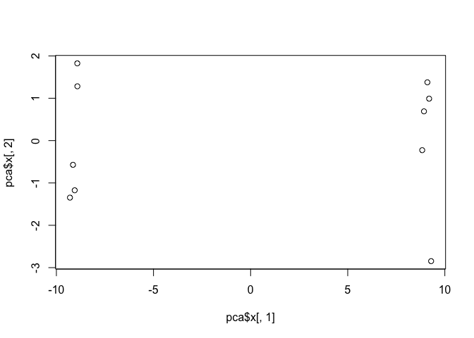 Let's see how well our PCs are doing (i.e. how much varaiance from the original data are they capturing)

``` r
pca.var <- pca$sdev^2
pca.var.per <- round(pca.var/sum(pca.var)*100, 1)

pca.var.per
```

    ##  [1] 91.4  2.2  1.7  1.5  1.3  0.7  0.5  0.4  0.3  0.0

Make a "scree-plot" to see the variance captured in each PC

``` r
barplot(pca.var.per, main="Scree Plot",
 xlab="Principal Component", ylab="Percent Variation")
```

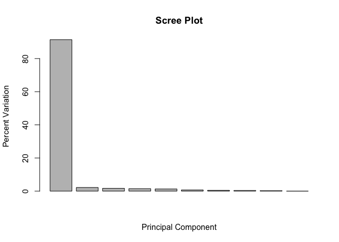 Let's make our plot more useful

``` r
colvec <- colnames(mydata)
colvec[grep("wt", colvec)] <- "red"
colvec[grep("ko", colvec)] <- "blue"
plot(pca$x[,1], pca$x[,2], col=colvec, pch=16,
 xlab=paste0("PC1 (", pca.var.per[1], "%)"),
 ylab=paste0("PC2 (", pca.var.per[2], "%)"))
```

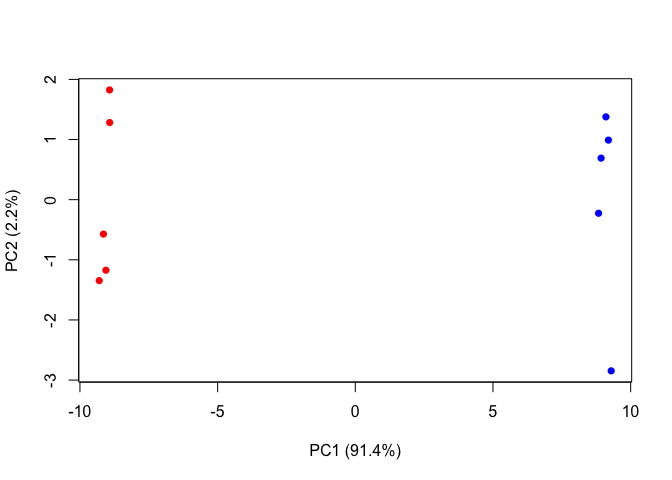
